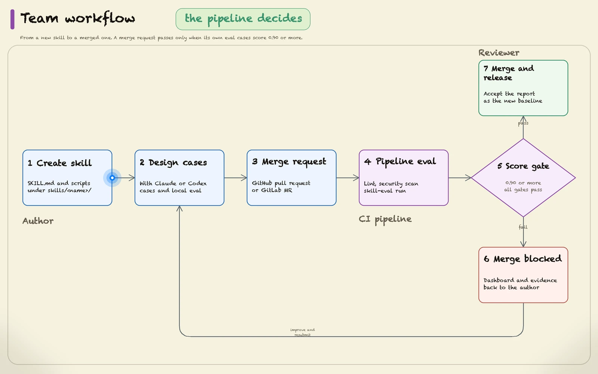

# Skill Marketplace

*English | [简体中文](README.zh-CN.md)*

Three agent skills packaged with their evaluation cases. Use the skills in your agent,
or run the evaluation kit to check skill selection, instruction following, artifacts,
and regressions. Evaluation runs through Strands; it is not a test of Claude Code's
entire runtime.

The kit evaluates skills whose deliverable is a media file, not only text. Every
file a run produces is collected and hashed as an artifact. Deterministic checks
measure it (draw.io XML structure, image dimensions, frame count and duration,
geometry against a reference image) and, under the `full` profile, a vision judge
reviews the rendered PNG, WebP, or MP4 frames against the request. Two of the three
skills here produce images or video.

## Team workflow

Every skill enters the marketplace through the same loop. The pipeline is the
reviewer of record: a merge request cannot merge until the skill's own evaluation
cases score at or above the team threshold.



The animation loops every 12.5 s. Open the [MP4 version](docs/assets/team-workflow.mp4)
to pause or step through it, or the [still PNG](docs/assets/team-workflow.png). The
diagram source is `docs/assets/team-workflow.spec.json`; re-render it with the
visual-flow-webp skill after editing.

| Step | Who | What passes it |
|---|---|---|
| 1. Create the skill | Author | A `SKILL.md` with a precise description, plus any scripts it needs |
| 2. Design cases and eval | Author with Claude or Codex | Tell the agent what the skill must do and what a good result looks like; it drafts at least three cases under `eval/` and runs the local evaluation until they pass |
| 3. Create the merge request | Author | Branch pushed, request opened against `main` |
| 4. Pipeline evaluation | CI | `repo-check` and `security-scan` pass, then `eval` runs only the affected skills |
| 5. Score gate | CI | Every case's overall score is at least 0.90 and no gating assertion fails |
| 6. Blocked | Author | Read `.eval/dashboard.html` from the run artifact, fix the skill or its cases, push again |
| 7. Merge | Reviewer | Approve, merge, and accept the report with `skill-eval baseline accept` so later runs compare against it |

Scores are reported on a 0–1 scale, so the threshold is 0.90. Branch protection
enforces the gate: require the `eval` check on `main` so a red evaluation cannot be
merged around. Setup for each platform is in [docs/github-ci.md](docs/github-ci.md)
and [docs/gitlab-ci.md](docs/gitlab-ci.md).

## Use the skills

Clone this repository, then add the local directory in Claude Code:

```text
/plugin marketplace add /absolute/path/to/skill-marketplace
/plugin install my-anycompany-skills@skill-marketplace
```

The marketplace currently distributes one plugin, `my-anycompany-skills`, containing all
three skills. Python evaluation dependencies are only needed if you run the eval kit.
Each skill's own scripts may still need dependencies described in its `SKILL.md`.

| Skill | Deliverable | Evaluation cases |
|---|---|---:|
| [aws-drawio-diagram](skills/aws-drawio-diagram/SKILL.md) | AWS architecture diagrams in draw.io XML | 4 |
| [folder-specific-claude-and-agents-md](skills/folder-specific-claude-and-agents-md/SKILL.md) | Folder context in `CLAUDE.md` and an `AGENTS.md` symlink | 2 |
| [visual-flow-webp](skills/visual-flow-webp/SKILL.md) | Generate diagrams or animate data flows over a reference image; PNG + WebP/GIF/MP4 | 6 |

## Evaluate one skill

Install Python 3.11+ and [uv](https://docs.astral.sh/uv/getting-started/installation/).
Run these commands from the repository root. The first `uv run` creates the project
virtual environment; `uv.lock` pins the framework and declared optional dependencies.

```bash
# Offline repository validation; no model calls.
uv run --locked skill-eval check

# Install only this skill's Python/npm/browser dependencies.
uv run --locked skill-eval setup --skill visual-flow-webp

# The MP4 case requires ffmpeg and ffprobe on PATH.
# macOS: brew install ffmpeg; Debian/Ubuntu: apt-get install ffmpeg

# Configure AWS credentials through your usual profile or environment first.
uv run --locked skill-eval doctor --skill visual-flow-webp
uv run --locked skill-eval run --skill visual-flow-webp
```

`run` automatically performs preflight, executes the cases, and scores the recording.
Agent and judge calls are billable. Omit `--skill` to select all skills, or repeat it
to select several. Repeat `--only <case-id>` to narrow the cases further. For a first
run without Node, a browser or an image renderer, select
`folder-specific-claude-and-agents-md` instead.

| Profile | Included |
|---|---|
| `core` (default) | Shared skill judges, assertions, deterministic checks, nonvisual plugin checks |
| `full` | Core plus plugin visual evaluation, extra passes, and available negative-control scripts |

Select `--profile full` on `doctor` and `run` for visual evaluation. Full draw.io
evaluation requires the draw.io desktop exporter. Setup does not install ffmpeg or
draw.io. A profile controls
which checks are requested; inspect each report's coverage and findings.

## Read and reuse a run

Each execution prints its directory under `.eval/runs/<run-id>/`. It contains the
resolved dataset, configuration, recording, artifacts, logs and scoring reports.
A score operation writes a new report without invoking the agent again:

```bash
uv run --locked skill-eval score --run <run-id>

# After reviewing report.json and report.meta.json, accept these exact scores.
uv run --locked skill-eval baseline accept \
  --report .eval/runs/<run-id>/scores/<score-id>/report.json
```

Missing or duplicate case records, missing/changed saved artifacts, failed execution,
and failed gating rows prevent success. An overall score drop greater than `0.05`
also fails comparison with `eval-baseline.json`; adjust `--tolerance` or use
`--no-baseline` for an explicitly unbaselined experiment. Known profile mismatches
fail comparison. Older baseline entries have no profile and are labelled as legacy.

Accepting a baseline does not run any models. It refuses incomplete reports, failed
gates and report bytes that differ from completion metadata; it can accept a
reviewed regression. Existing scores for other cases remain unchanged. The old
`--update-baseline` scoring switch is removed.

Re-scoring still costs judge calls and can vary with model sampling, current plugins,
reference files and dependencies. These are local archives, not portable frozen
execution environments: saved paths refer to this checkout. The committed baseline
currently covers the original five visual-flow cases; the new reference-image
overlay case and the other skills' cases have no baseline.

The low-level scripts default to `.eval/manual/results.json`,
`.eval/manual/eval-report.json`, and separate `artifacts/` and `derived/` directories
under `.eval/manual/`. This is a reusable scratch location; use the CLI for separate
run archives. Explicit `--out`, `--results` and `--artifacts` paths remain supported.
Older root-level reports can be stored in `.eval/legacy/`; keep the artifact paths
they reference intact. The tracked `eval-baseline.json` stays at the repository root.

## Configure models

Configuration is shared by both phases. Exported environment variables are inherited
by both child processes; they do not need to be exported twice.

| Setting | Agent | Judge |
|---|---|---|
| Provider | `MODEL_PROVIDER`, default `bedrock` | `JUDGE_MODEL_PROVIDER`, then `MODEL_PROVIDER` |
| Model | `MODEL_ID`, then `BEDROCK_MODEL_ID` | `JUDGE_MODEL_ID` |
| Bedrock default | `us.anthropic.claude-sonnet-4-5-20250929-v1:0` | `global.anthropic.claude-sonnet-4-6` |

Region precedence is `AWS_REGION`, `AWS_DEFAULT_REGION`, AWS profile region, then
`us-east-1`. Use a model or inference-profile ID available in that region. Grant the
appropriate model resources `bedrock:InvokeModel` and
`bedrock:InvokeModelWithResponseStream` for the streaming agent and judges.

For an OpenAI-compatible endpoint, configure both model IDs before running setup:

```bash
export MODEL_PROVIDER=openai
export MODEL_ID=your-agent-model
export JUDGE_MODEL_ID=your-judge-model
export OPENAI_BASE_URL=http://localhost:8000/v1
# For a hosted endpoint, set OPENAI_API_KEY as appropriate.
uv run --locked skill-eval setup --skill folder-specific-claude-and-agents-md
uv run --locked skill-eval run --skill folder-specific-claude-and-agents-md
```

`JUDGE_OPENAI_BASE_URL` and `JUDGE_OPENAI_API_KEY` override the judge endpoint.
Models need reliable tool calling; visual judges also need image input support.
Doctor checks configuration and, for Bedrock, resolves STS identity; it does not
prove model permissions or endpoint compatibility. Pure OpenAI runs do not require
AWS credentials. `score` preflight only validates the judge's model configuration.

## Contribute and maintain

- [Contribution checklist](CONTRIBUTING.md)
- [Author guide and dataset reference](docs/adding-a-skill.md)
- [Architecture, directory responsibilities and limits](docs/architecture.md)
- [Findings that shaped the evaluation design](docs/evaluation-history.md)

`skills/<name>/eval/` is optional to the plugin consumer but required for a skill to
participate in evaluation. `eval/plugin.py` is optional: the folder-context skill
uses shared judges without a domain plugin. Negative-control coverage is incomplete;
only visual-flow currently supplies an executable control. `check --strict` also
fails coverage warnings, while ordinary `check` reports them.

Both CI definitions use `skill-eval setup` and `skill-eval run --profile core --negative-controls`
and share one selection rule. A pipeline starts on pull/merge request creation and
updates, selecting skills from the entire request diff. Changes under one skill
evaluate that skill; shared framework, dependency or CI changes evaluate all skills.
Documentation-only requests run offline checks only; a manual run (**Run workflow**
on GitHub, **Run pipeline** on GitLab) evaluates everything. Branch pushes do not
create a second pipeline. The required eval fails when credentials are unavailable
(`EVAL_ROLE_ARN` assumed through OIDC on GitHub, `AWS_CREDS_TARGET_ROLE` on GitLab)
rather than skipping. Offline checks and framework unit tests need no credentials.
The renderer tests use the `visual` extra; install `ffmpeg` to include MP4
encode/decode checks (both CI jobs do this). Per-case visual evaluation remains a
separate full-profile run; CI retains the existing negative-control checks.

Both publish `.eval/` after every eval job, including failures: `dashboard.html`,
`summary.json`, the selection record and `runs/` with evidence. GitHub uploads it as
the **skill-evaluation** artifact and writes the scores to the job's step summary;
GitLab exposes it as **Skill evaluation** on the MR. See
[GitHub Actions configuration](docs/github-ci.md) and
[GitLab CI configuration and notifications](docs/gitlab-ci.md) for role trust,
merge settings, selection rules and extension points.

```bash
uv run --locked --extra visual python -m unittest discover -s tests -v
```

`tools/release.py` bumps manifests, writes changelog entries, commits and tags. It does
not enforce evaluation success; review and run checks before invoking it. For manual
pip users, `requirements.txt` installs this project's base dependencies; uv is the
supported locked workflow. Running `uv sync` without extras may remove dependencies
installed by setup, so rerun setup afterwards.

## License

[MIT](LICENSE). Two skills were adapted from MIT-licensed upstream projects and keep
their original notices: `skills/visual-flow-webp/LICENSE-upstream` and
`skills/folder-specific-claude-and-agents-md/LICENSE-upstream`.
