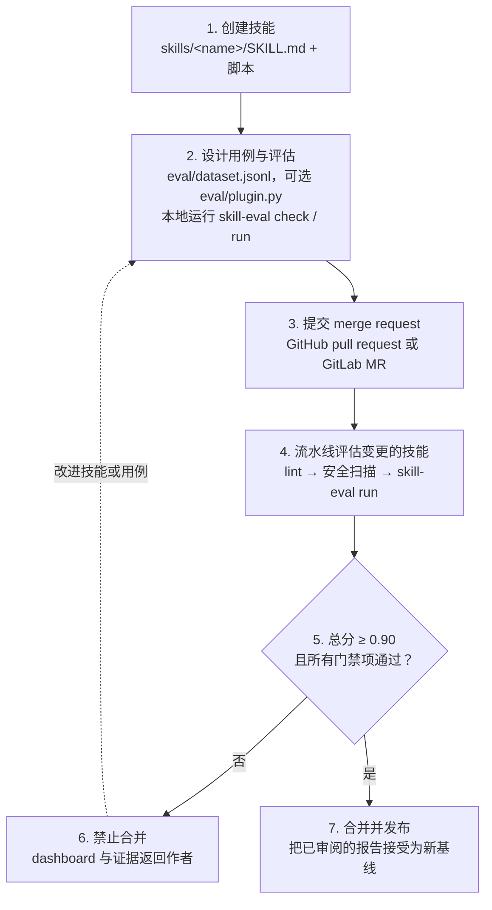

# Skill Marketplace

*[English](README.md) | 简体中文*

三个 agent skill，和各自的评估用例一起维护。可以直接在 agent 中使用 skill，也可以运行
评估工具，检查技能选择、指令遵循、交付物和回归。评估通过 Strands 执行，结果反映的是
这套测试环境下的表现，不等同于对 Claude Code 完整运行环境的测试。

## 团队协作流程

每个技能都通过同一条闭环进入 marketplace。流水线是正式的评审者：技能自带的评估用例
达到团队阈值之前，merge request 不能合并。



| 步骤 | 角色 | 通过条件 |
|---|---|---|
| 1. 创建技能 | 作者 | 一份描述精确的 `SKILL.md`，以及需要的脚本 |
| 2. 设计用例与评估 | 作者 | `eval/dataset.jsonl` 至少三个用例；本地 `skill-eval check` 与 `skill-eval run` 通过 |
| 3. 提交 merge request | 作者 | 推送分支，向 `main` 发起请求 |
| 4. 流水线评估 | CI | `repo-check` 与 `security-scan` 通过后，`eval` 只运行受影响的技能 |
| 5. 分数门禁 | CI | 每个用例总分不低于 0.90，且没有门禁断言失败 |
| 6. 禁止合并 | 作者 | 从运行 artifact 中打开 `.eval/dashboard.html`，修正技能或用例后再次推送 |
| 7. 合并 | 评审者 | 批准、合并，并用 `skill-eval baseline accept` 接受报告，供后续运行对比 |

报告中的分数是 0–1 区间，阈值即 0.90。用分支保护强制门禁：在 `main` 上要求 `eval`
检查通过，评估未过就无法绕过合并。各平台的配置见 [docs/github-ci.md](docs/github-ci.md)
和 [docs/gitlab-ci.md](docs/gitlab-ci.md)。

## 使用技能

克隆仓库后，在 Claude Code 中添加本地目录：

```text
/plugin marketplace add /absolute/path/to/skill-marketplace
/plugin install my-anycompany-skills@skill-marketplace
```

目前 marketplace 分发一个插件 `my-anycompany-skills`，包含全部三个技能。仅使用技能无需安装
Python 评估依赖；技能自己的脚本依赖仍按各自的 `SKILL.md` 安装。

| 技能 | 交付物 | 评估用例 |
|---|---|---:|
| [aws-drawio-diagram](skills/aws-drawio-diagram/SKILL.md) | AWS 架构图，draw.io XML 格式 | 4 |
| [folder-specific-claude-and-agents-md](skills/folder-specific-claude-and-agents-md/SKILL.md) | 目录级 `CLAUDE.md` 与 `AGENTS.md` 软链 | 2 |
| [visual-flow-webp](skills/visual-flow-webp/SKILL.md) | PNG，以及动画 WebP、GIF 或可暂停的 MP4 | 5 |

## 评估一个技能

准备 Python 3.11+ 和 [uv](https://docs.astral.sh/uv/getting-started/installation/)，在仓库根目录
执行。首次 `uv run` 会建立虚拟环境；`uv.lock` 锁定框架及已声明的可选依赖。

```bash
# 仓库静态检查，不调用模型。
uv run --locked skill-eval check

# 只安装所选技能的 Python、npm 和浏览器依赖。
uv run --locked skill-eval setup --skill visual-flow-webp

# MP4 用例要求 PATH 中有 ffmpeg 和 ffprobe。
# macOS: brew install ffmpeg；Debian/Ubuntu: apt-get install ffmpeg

# 先通过常用的 profile 或环境变量配置 AWS 凭据。
uv run --locked skill-eval doctor --skill visual-flow-webp
uv run --locked skill-eval run --skill visual-flow-webp
```

`run` 自动完成预检、执行和评分，agent 与 judge 调用都会产生模型费用。省略 `--skill`
评估全部技能，重复该参数可以选择多个技能；重复 `--only <case-id>` 可以进一步缩小范围。
首次体验可选 `folder-specific-claude-and-agents-md`，它不需要 Node、浏览器或图像渲染器。

| 配置 | 包含的检查 |
|---|---|
| `core`，默认 | 通用技能 judge、断言、确定性检查、插件的非视觉检查 |
| `full` | core 加插件视觉评估、额外评分，以及仓库已有的负对照脚本 |

需要视觉评估时，在 `doctor` 和 `run` 后加 `--profile full`。draw.io 的完整视觉评估需要
桌面版导出程序。setup 不负责安装 ffmpeg 或 draw.io。
配置决定请求哪些检查，实际覆盖情况与跳过原因要看报告。

## 查看和复用结果

每次执行都会打印 `.eval/runs/<run-id>/` 路径，保存已解析的数据集、配置、执行记录、
产物、日志和评分报告。重新评分会生成新的报告，不再次执行 agent：

```bash
uv run --locked skill-eval score --run <run-id>

# 审阅 report.json 和 report.meta.json 后，接受这一份报告的分数。
uv run --locked skill-eval baseline accept \
  --report .eval/runs/<run-id>/scores/<score-id>/report.json
```

用例记录缺失或重复、产物丢失或被改动、执行失败、门禁行失败，都不能通过。对照
`eval-baseline.json`，总分下降超过 `0.05` 也会失败；可用 `--tolerance` 调整容差，或明确
用 `--no-baseline` 做无基线实验。已知配置不同的 core/full 不能直接比较；旧基线没有配置
字段时，会标注为 legacy。

接受基线不会调用模型，会拒绝未完成、门禁失败，以及内容与完成时哈希不一致的报告。
可以接受已经审阅的预期退步，其他用例的基线保留。旧的评分参数 `--update-baseline` 已移除。

重新评分仍消耗 judge 调用，结果可能受到模型采样、当前插件、参考文件和依赖的影响。
运行目录是本机档案，并非可移植的冻结环境，保存的路径仍指向当前 checkout。当前已提交
的基线只覆盖五个 visual-flow 用例，其他用例尚无基线。

底层脚本默认写入 `.eval/manual/results.json`、`.eval/manual/eval-report.json`，
原始与派生产物分别放在该目录的 `artifacts/` 和 `derived/`。manual 是可覆盖的临时目录；
需要每次独立归档时使用 CLI。仍可通过 `--out`、`--results`、`--artifacts` 指定路径。
旧的根目录结果文件可归档到 `.eval/legacy/`，但要保留其引用的产物路径。
需要版本管理的 `eval-baseline.json` 继续放在根目录。

## 配置模型

两个阶段共用环境配置。shell 中导出的环境变量会被两个子进程继承，无需分别 export。

| 设置 | 被测 agent | Judge |
|---|---|---|
| Provider | `MODEL_PROVIDER`，默认 `bedrock` | `JUDGE_MODEL_PROVIDER`，回退到 `MODEL_PROVIDER` |
| Model | `MODEL_ID`，回退到 `BEDROCK_MODEL_ID` | `JUDGE_MODEL_ID` |
| Bedrock 默认值 | `us.anthropic.claude-sonnet-4-5-20250929-v1:0` | `global.anthropic.claude-sonnet-4-6` |

区域按 `AWS_REGION`、`AWS_DEFAULT_REGION`、AWS profile 区域、`us-east-1` 的顺序解析。
使用目标区域支持的模型或 inference-profile ID。为相关模型资源配置 `bedrock:InvokeModel`
和 `bedrock:InvokeModelWithResponseStream` 权限，以支持 agent 与 judge 的流式调用。

使用 OpenAI 兼容端点时，在 setup 前配置两个模型 ID：

```bash
export MODEL_PROVIDER=openai
export MODEL_ID=your-agent-model
export JUDGE_MODEL_ID=your-judge-model
export OPENAI_BASE_URL=http://localhost:8000/v1
# 托管端点按需设置 OPENAI_API_KEY。
uv run --locked skill-eval setup --skill folder-specific-claude-and-agents-md
uv run --locked skill-eval run --skill folder-specific-claude-and-agents-md
```

`JUDGE_OPENAI_BASE_URL` 和 `JUDGE_OPENAI_API_KEY` 可单独覆盖 judge 的端点。
模型需要可靠的工具调用能力，视觉 judge 还需支持图片输入。Doctor 检查配置，并在使用
Bedrock 时验证 STS 身份；它不能证明具体模型权限或端点功能兼容。纯 OpenAI 配置不要求
AWS 凭据，`score` 预检只验证 judge 的模型配置。

## 贡献与维护

- [贡献清单](CONTRIBUTING.md)
- [作者指南与数据集字段](docs/adding-a-skill.zh-CN.md)
- [架构、目录职责与边界](docs/architecture.md)
- [影响评估设计的历史发现](docs/evaluation-history.md)

插件消费者不需要 `eval/`，但技能参与评估需要自己的数据集。`eval/plugin.py` 可选，目录
上下文技能没有领域插件，仍会运行共享 judge。负对照尚未完整覆盖，目前只有 visual-flow
提供可执行的负对照。普通 `check` 输出覆盖警告，`check --strict` 会把这些警告也视为失败。

两套 CI 都使用 `skill-eval setup` 与 `skill-eval run --profile core --negative-controls`，
并共用同一套选择规则。在创建或更新 Pull Request / Merge Request 时触发，按整个请求的
diff 选择技能：某个 `skills/<name>/` 有变更，就评估该技能；共享框架、依赖或 CI 配置变更
则跑全量。仅修改仓库文档时只跑静态检查；手动触发（GitHub 的 **Run workflow**、GitLab 的
**Run pipeline**）跑全量。普通分支 push 不会额外创建一条重复 pipeline。

必要评估任务在缺少凭据时会失败而不是跳过：GitHub 通过 OIDC 假设 secret `EVAL_ROLE_ARN`
指定的角色，GitLab 使用 `AWS_CREDS_TARGET_ROLE`。静态检查及框架单元测试不需要凭据。
逐用例视觉评估另行以 full 执行，CI 保留已有负对照检查。

两套 CI 在每次评估后都会发布 `.eval/`（包括失败的运行）：`dashboard.html`、供通知系统
使用的 `summary.json`、选择记录和包含证据的 `runs/`。GitHub 以 **skill-evaluation**
artifact 上传，并把分数写入任务的 step summary；GitLab 在 MR 的 **Skill evaluation**
入口提供。下载并解压完整 artifact 后打开 dashboard，即可通过相对链接查看证据。
角色信任、合并门禁与扩展方式见 [GitHub Actions 配置说明](docs/github-ci.md) 和
[GitLab CI 配置说明](docs/gitlab-ci.md)。

```bash
uv run --locked python -m unittest discover -s tests -v
```

`tools/release.py` 会更新 manifest、changelog、提交并打 tag，但不强制检查评估结果，使用前
需自行审阅并运行检查。手动使用 pip 时，`requirements.txt` 安装项目基础依赖；推荐使用 uv
锁定流程。不带 extras 的 `uv sync` 可能移除 setup 安装的技能依赖，之后重新 setup 即可。
