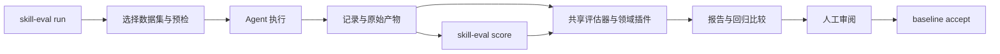

# 架构与目录职责 / Architecture and layout

目前采用单仓库是合适的：四个技能共享同一个插件入口和评估框架。每个技能的领域逻辑
留在自身目录，共享框架只负责发现、执行、记录、评分编排和回归比较。不需要为每个
skill 再建一个 Python 包，也不需要提前拆成多仓库。

## 目录规划

```text
skill-marketplace/
├── .claude-plugin/           Claude Code marketplace 与插件 manifest
├── skills/
│   └── <name>/
│       ├── SKILL.md          技能入口；名称与目录名保持一致
│       ├── scripts/          给技能使用者执行的程序、自己的 npm 清单
│       ├── requirements.txt  技能的 Python 依赖（需要时）
│       ├── references/       agent 可读取的背景资料、格式规范
│       ├── examples/         agent 可参考的示例（需要时）
│       └── eval/
│           ├── dataset.jsonl       该技能拥有的评估用例
│           ├── plugin.py           可选领域评估扩展
│           ├── dependencies.json   可选系统工具声明
│           ├── fixtures/           测试输入
│           ├── reference/          评估专用参考图与校准说明
│           └── negative-control/   有意不合格的输入及评分上限
├── evalkit/                  跨技能的 Python 框架
│   ├── cli.py                唯一推荐命令入口 skill-eval
│   ├── doctor.py             所选技能、用例、provider 的依赖预检
│   ├── records.py            选择、记录完整性、原子写入、基线接受
│   ├── run_eval.py           第一阶段：执行与确定性检查
│   ├── run_strands_eval.py   第二阶段：复用记录并评分
│   ├── sandbox.py            临时工作区与工具执行
│   └── ...                   数据集、模型配置、轨迹及通用评估器
├── tests/                    共享框架的离线回归测试
├── tools/                    仓库维护工具，目前只有 release.py
├── docs/                     作者指南、设计边界、历史发现与演示材料
├── .eval/runs/<run-id>/      本机运行产物，git 忽略
├── .eval/manual/             底层脚本的默认临时输出，可被后续运行覆盖
├── .eval/legacy/             历史结果文件归档，不伪装成完整的新运行档案
├── eval-baseline.json        经审阅接受的评分基线，需要版本管理
├── pyproject.toml            Python 依赖与 CLI 声明
├── uv.lock                   锁定的依赖解析
├── requirements.txt          pip 兼容入口，转到 pyproject.toml
└── README*.md                面向使用者的入口
```

`references/` 与 `eval/reference/` 名称相近但用途不同：前者是技能知识，后者是评估证据。
本次保留现有名称，避免破坏技能内的路径。新增技能沿用该约定即可。

`evalkit` 是已有的 Python 包，当前规模下无需再套一层 `src/`。将来只有框架需要独立
发布到 PyPI、拥有独立版本周期时，再考虑独立包及 `src` 布局。目前推荐在 checkout 内
通过 uv 运行；框架依赖相邻的 `skills/`，不是可脱离仓库使用的独立 wheel 产品。

`tools/` 放维护者工具，`skills/*/scripts/` 放技能执行程序，避免出现三个含义不清的
`scripts` 目录。`tests/` 验证框架是否正确处理记录、失败和配置；`skills/*/eval/` 验证
agent 使用技能的效果。这两类测试需要分别保留。

## 执行和证据



每次执行和每次重新评分都分配新目录：

```text
.eval/runs/<run-id>/
  run.json                   选择、配置、模型、数据与锁文件哈希、运行状态
  cases.json                 解析 seed 文件后的用例快照
  results.json               逐用例写入的执行记录、模型来源、耗时
  execute.log
  artifacts/<case-id>/       原始交付物
  scores/<score-id>/
    report.json              用例评分列表、coverage、findings
    report.meta.json         请求用例、哈希、完成与门禁状态、回归信息
    score.log
    derived/<case-id>/       插件渲染、对比等派生产物
    control-<skill>.log      已执行的负对照日志
```

重新评分默认使用当时的用例快照与执行记录，以及**当前**插件、参考资料和 judge 配置。
原来的完整 `SKILL.md` 工具响应保留在轨迹中，指令遵循评估据此评分。源码指纹帮助识别
评估输入变化，不保证模型评分可复现。归档不保存凭据，也不是容器快照；移动 checkout、
删除原始文件或改变工具链，都可能导致旧记录不能重新评分。

负对照脚本拥有自己的临时渲染目录，路径写入日志；这些临时图像目前不保证被归档。
CI 和本地统一命令，但模型可用性、操作系统字体及渲染环境仍可能不同。

根目录的 `results.*`、`eval-report*` 是旧入口遗留的运行产物，不属于源码目录。
历史文件移动到 `.eval/legacy/<id>/` 时保留字节和产物引用，迁移清单记录原路径与哈希。
旧 `artifacts/` 如果仍被这些记录引用，应保留，不能只改目录名而让记录失去证据。
legacy 文件没有新 CLI 的用例快照和完成元数据，不能直接当作新运行接受基线。

## 依赖与覆盖边界

- `setup` 读取所选技能的 Python requirements 和 npm manifest，安装对应依赖与 Chromium。
  Python 依赖由 `uv.lock` 导出的约束限制；新技能新增的包也应加入根项目可选依赖并更新锁文件。
- `eval/dependencies.json` 支持 `commands`、`visual_commands`、`case_commands`。
  后者按用例 ID 声明系统命令，例如 MP4 用例需要 `ffmpeg` 和 `ffprobe`。
- `run` 默认 core；full 请求插件视觉检查并运行已有负对照。
  CI 使用 `core --negative-controls`，保留校准检查而不运行每个用例的视觉 judge。
- 主 Experiment 中所有评分行都参与门禁。`ExtraExperiment.gate=False` 将整个额外
  Experiment 设为仅跟踪；不是在任意 evaluator 上添加同名属性就会生效。
- 当前没有领域插件的技能仍运行共享模型 judge。负对照没有自动覆盖所有技能，报告会
  区分未提供脚本与执行失败。全仓库当前有 16 个用例，基线只覆盖 visual-flow 原有的 5 个；新增参考图叠加用例尚无模型评分基线。
- `sandbox.py` 提供临时工作区和工具约束，Bash 仍在宿主机执行；它不是操作系统级隔离。
  面向不可信技能的大规模执行需要另行配置容器或隔离运行环境。

## 后续再做的拆分

当 marketplace 的插件数量增加时，再将 `plugins/<plugin-name>/` 作为插件分发单位，并由
manifest 指向各插件目录。目前一个插件包含四个 skill 已足够清楚。评估数据、插件和基线
应保持同一版本关系；不建议先把所有用例搬到根目录的 `evals/`，这样会拆散维护边界。

`docs/how-it-works-slide.*` 是现有演示材料。本次保留其位置与内容，避免影响链接；演示材料
增多时，可以统一迁入 `docs/presentations/`，同时更新所有引用。
